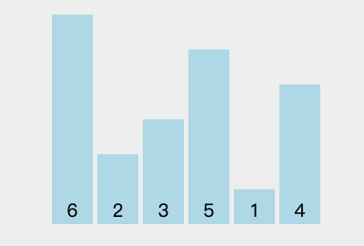

# 01.03.02 选择排序（第 05 天）

## 1. 选择排序算法思想

> **选择排序（Selection Sort）基本思想**：
>
> 将序列分为两部分：前边 `i - 1` 个元素为已排序部分，后边 `n - i + 1` 个元素为未排序部分。第 `i` 趟排序从未排序部分 `n − i + 1 (i = 1, 2, …, n − 1)` 个元素中选择一个值最小的元素与未排序部分最前面那个元素交换位置，即与整个序列的第 `i` 个位置上的元素交换位置。如此下去，直到所有元素都变为已排序部分，排序结束。

简单来说，「选择排序算法」是在每一趟排序中，从未排序部分中选出一个值最小的元素，与未排序部分第 `1` 个元素交换位置，从而将该元素划分到已排序部分。

## 2. 选择排序算法步骤

1. 第 `1` 趟排序：
   1. 无已排序部分，把第 `1` ~ `n `个元素（总共 `n ` 个元素）作为未排序部分。
   2. 遍历 `n` 个元素，使用变量 `min_i` 记录 `n` 个元素中值最小的元素位置。
   3. 将 `min_i` 与未排序部分第 `1` 个元素（也就是序列的第 `1` 个元素）交换位置。如果未排序部分第 `1` 个元素就是值最小的元素位置，则不用交换。
   4. 此时第 `1` 个元素为已排序部分，剩余第 `2` ~ `n` 个元素（总共 `n - 1` 个元素）为未排序部分。
2. 第 `2` 趟排序：
   1. 遍历剩余 `n - 1` 个元素，使用变量 `min_i` 记录 `n - 1` 个元素中值最小的元素位置。
   2. 将 `min_i` 与未排序部分第 `1` 个元素（也就是序列的第 `2` 个元素）交换位置。如果未排序部分第 `1` 个元素就是值最小的元素位置，则不用交换。
   3. 此时第 `1` ~ `2` 个元素为已排序部分，剩余第 `3` ~ `n` 个元素（总共 `n - 2` 个元素）为未排序部分。
3. 依次类推，对剩余 `n - 2` 个元素重复上述排序过程，直到所有元素都变为已排序部分，则排序结束。

## 3. 选择排序动画演示



1. 初始序列为：`[6, 2, 3, 5, 1, 4]`。
2. 第 `1` 趟排序，无已排序部分，把 `[6, 2, 3, 5, 1, 4]`（总共 `6 ` 个元素）作为未排序部分：
   1. 遍历这 `6` 个元素，使用变量 `min_i` 记录 `6` 个元素中值最小（值为 `1`）的元素位置，也就是第 `5` 个元素位置。
   2. 将 `min_i` 与未排序部分第 `1` 个元素（也就是序列的第 `1` 个元素）交换位置，就是将元素 `6` 和元素 `1` 交换位置。
   3. 此时 `[1]` 为已排序部分，剩余 `[2, 3, 5, 6, 4]`（总共 `5` 个元素）为未排序部分。此时序列为 `[1, 2, 3, 5, 6, 4]`。
3. 第 `2` 趟排序，把 `[1]` 作为已排序部分，把剩余 `[2, 3, 5, 6, 4] `（总共 `5` 个元素）作为未排序部分。
   1. 遍历剩余 `5` 个元素，使用变量 `min_i` 记录 `5` 个元素中值最小的元素位置，也就是第 `2` 个元素位置。
   2. 因为值最小的元素位置 `min_i` 就是未排序部分第 `1` 个元素，所以不用交换。
   3. 此时 `[1, 2]` 为已排序部分，剩余 `[3, 5, 6, 4]`（总共 `4` 个元素）为未排序部分。
4. 依次类推，对剩余 `4` 个元素重复上述排序过程，直到所有元素都变为已排序部分，则排序结束。此时，序列变为 `[1, 2, 3, 4, 5, 6]`。

## 4. 选择排序算法分析

- **时间复杂度**：$O(n^2)$。排序法所进行的元素之间的比较次数与序列的原始状态无关，时间复杂度总是 $O(n^2)$。
  - 这是因为无论序列中元素的初始排列状态如何，第 `i` 趟排序要找出值最小元素都需要进行 `n − i` 次元素之间的比较。因此，整个排序过程需要进行的元素之间的比较次数都相同，为 $∑^n_{i=2}(i - 1) = \frac{n(n−1)}{2}$ 次，所以时间复杂度为 $O(n^2)$。
- **选择排序适用情况**：选择排序方法在排序过程中需要移动较多次数的元素，并且排序时间效率比较低。因此，选择排序方法比较适合于参加排序序列的数据量较小的情况。选择排序的主要优点是仅需要原地操作无需占用其他空间就可以完成排序，因此在空间复杂度要求较高时，可以考虑选择排序。

- **排序稳定性**：由于值最小元素与未排序部分第 `1` 个元素的交换动作是在不相邻的元素之间进行的，因此很有可能会改变值相同元素的前后位置，因此，选择排序法是一种 **不稳定排序算法**。

## 5. 选择排序代码实现

```Python
class Solution:
    def selectionSort(self, arr):
        for i in range(len(arr) - 1):
            # 记录未排序部分中最小值的位置
            min_i = i
            for j in range(i + 1, len(arr)):
                if arr[j] < arr[min_i]:
                    min_i = j
            # 如果找到最小值的位置，将 i 位置上元素与最小值位置上的元素进行交换
            if i != min_i:
                arr[i], arr[min_i] = arr[min_i], arr[i]
        return arr

    def sortArray(self, nums: List[int]) -> List[int]:
        return self.selectionSort(nums)
```

