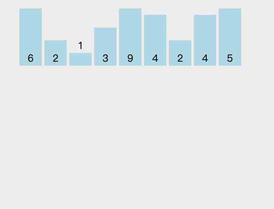

# 01.03.14 计数排序（第 08 天）

## 1. 计数排序算法思想

> **计数排序（Counting Sort）基本思想**：
>
> 使用一个额外的数组 `counts`，其中 `counts[i]` 表示原数组 `arr` 中值等于 `i` 的元素个数。然后根据数组 `counts` 来将 `arr` 中的元素排到正确的位置。

## 2. 计数排序算法步骤

1. 找出待排序序列中最大值元素 `arr_max` 和最小值元素 `arr_min`。
2. 定义大小为 `arr_max - arr_min + 1` 的数组 `counts`，初始时，`counts` 中元素值全为 `0`。
3. 遍历数组 `arr`，统计值为 `num` 的元素出现的次数。将其次数存入 `counts` 数组的第 `num - arr_min` 项（`counts[num - arr_min]` 表示元素值 `num` 出现的次数）。
4. 对所有的计数累加，从 `counts` 中的第一个元素开始，每一项和前一项相加。此时 `counts[i]` 表示值为 `i` 的元素排名。
5. 反向填充目标数组：
	1. 逆序遍历数组 `arr`。对于每个元素值 `arr[i]`，其对应排名为 `counts[arr[i] - arr_min]`。
	2. 根据排名，将 `arr[i]` 放在数组对应位置（因为数组下标是从 `0` 开始的，所以对应位置为排名减 `1`）。即 `res[counts[arr[i] - arr_min] - 1] = arr[i]`。
	3. 放入之后， 将 `arr[i]` 的对应排名减 `1`，即 `counts[arr[i] - arr_min] -= 1`。

## 3. 计数排序动画演示



## 4. 计数排序算法分析

- **时间复杂度**：$O(n + k)$。其中 $k$ 代表待排序序列的值域。
- **空间复杂度**：$O(k)$。其中 $k$ 代表待排序序列的值域。由于用于计数的数组 `counts` 的长度取决于待排序数组中数据的范围（大小等于待排序数组最大值减去最小值再加 `1`）。所以计数排序算法对于数据范围很大的数组，需要大量的内存。
- **计数排序适用情况**：计数排序一般用于整数排序，不适用于按字母顺序、人名顺序排序。
- **排序稳定性**：计数排序是一种 **稳定排序算法**。

## 5. 计数排序代码实现

```Python
class Solution:
    def countingSort(self, arr):
        # 计算待排序序列中最大值元素 arr_max 和最小值元素 arr_min
        arr_min, arr_max = min(arr), max(arr)
        # 定义计数数组 counts，大小为 最大值元素 - 最小值元素 + 1
        size = arr_max - arr_min + 1
        counts = [0 for _ in range(size)]
        
        # 统计值为 num 的元素出现的次数
        for num in arr:
            counts[num - arr_min] += 1
        
        # 计算元素排名
        for j in range(1, size):
            counts[j] += counts[j - 1]

        # 反向填充目标数组
        res = [0 for _ in range(len(arr))]
        for i in range(len(arr) - 1, -1, -1):
            # 根据排名，将 arr[i] 放在数组对应位置
            res[counts[arr[i] - arr_min] - 1] = arr[i]
            # 将 arr[i] 的对应排名减 1
            counts[arr[i] - arr_min] -= 1

        return res

    def sortArray(self, nums: List[int]) -> List[int]:
        return self.countingSort(nums)
```

 
