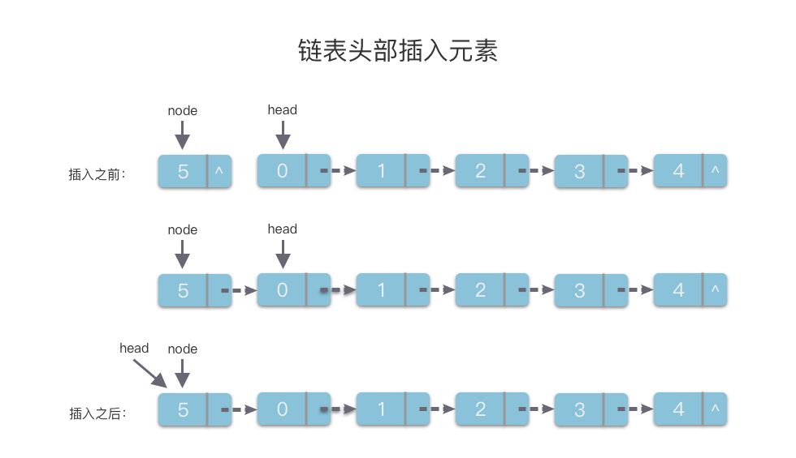
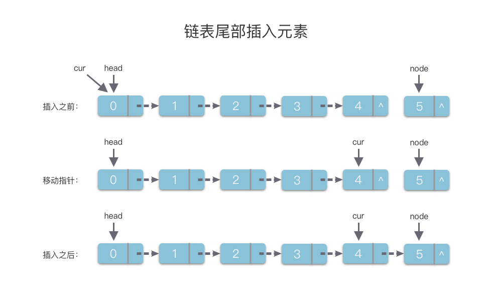
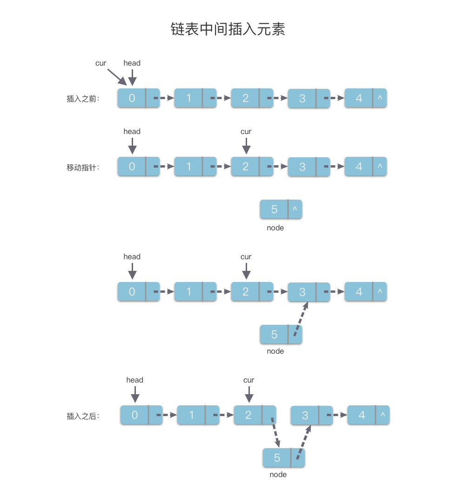
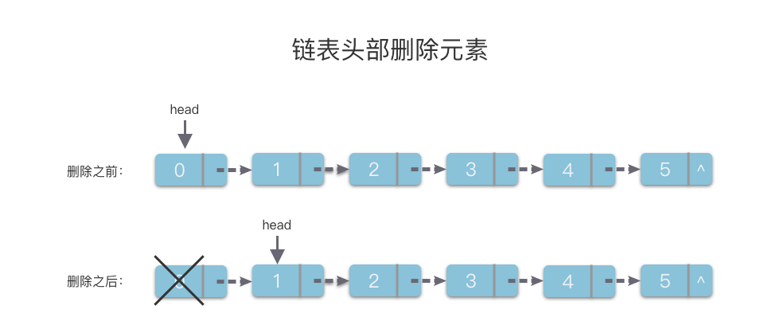
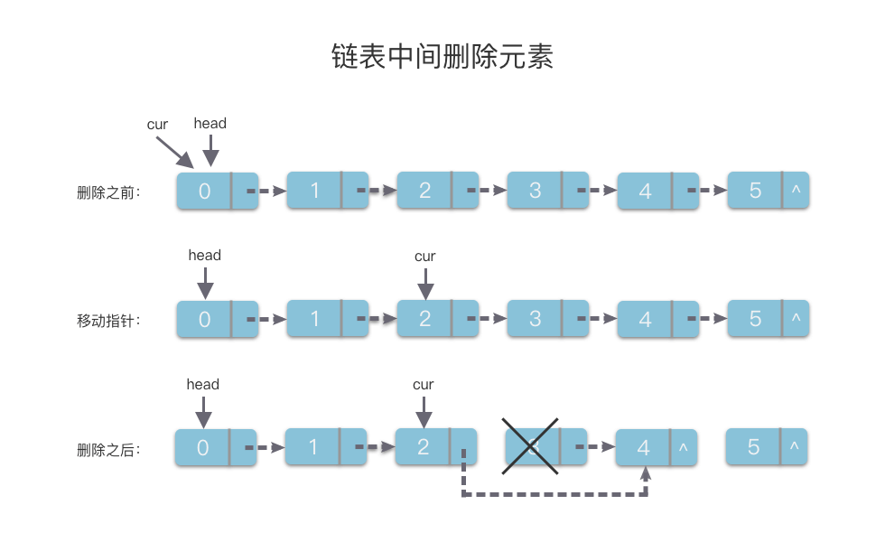

# 02.01.01 链表基础知识（第 01 ~ 02 天）

## 1. 链表简介

### 1.1 链表定义

> **链表（Linked List）**：一种线性表数据结构。它使用一组任意的存储单元（可以是连续的，也可以是不连续的），来存储一组具有相同类型的数据。

简单来说，**「链表」** 是实现线性表链式存储结构的基础。

以单链表为例，链表的存储方式如下图所示。


如上图所示，链表通过将一组任意的存储单元串联在一起。其中，每个数据元素占用若干存储单元的组合称为一个「链节点」。为了将所有的节点串起来，每个链节点不仅要存放一个数据元素的值，还要存放一个指出这个数据元素在逻辑关系上的直接后继元素所在链节点的地址，该地址被称为「后继指针 `next`」。

在链表中，数据元素之间的逻辑关系是通过指针来间接反映的。逻辑上相邻的数据元素在物理地址上可能相邻，可也能不相邻。其在物理地址上的表现是随机的。

我们先来简单介绍一下链表结构的优缺点：

- **优点**：存储空间不必事先分配，在需要存储空间的时候可以临时申请，不会造成空间的浪费；一些操作的时间效率远比数组高（插入、移动、删除元素等）。

- **缺点**：不仅数据元素本身的数据信息要占用存储空间，指针也需要占用存储空间，链表结构比数组结构的空间开销大。

接下来先来介绍一下除了单链表之外，链表的其他几种类型。

### 1.2 双向链表

> **双向链表（Doubly Linked List）**：链表的一种，也叫做双链表。它的每个链节点中有两个指针，分别指向直接后继和直接前驱。

从双链表的任意一个节点开始，都可以很方便的访问它的前驱节点和后继节点。


### 1.3 循环链表

> **循环链表（Circular linked list）**：链表的一种。它的最后一个链节点指向头节点，形成一个环。

从循环链表的任何一个节点出发都能找到任何其他节点。


接下来我们以单链表为例，介绍一下链表的基本操作。

## 2. 链表的基本操作

数据结构的操作一般涉及到增、删、改、查 4 种情况，链表的操作也基本上是这 4 种情况。我们一起来看一下链表的基本操作。

### 2.1 链表的结构定义

链表是由链节点通过 `next` 链接而构成的，所以先来定义一个简单的链节点类，即 `ListNode` 类。`ListNode` 类使用成员变量 `val` 表示数据元素的值，使用指针变量 `next` 表示后继指针。

然后再定义链表类，即 `LinkedList` 类。`ListkedList` 类中只有一个链节点变量 `head` 用来表示链表的头节点。

我们在创建空链表时，只需要把相应的链表头节点变量设置为空链接即可。在 `Python` 里可以将其设置为 `None`，其他语言也有类似的惯用值，比如 `NULL`、`nil`、`0` 等。

**「链节点以及链表的结构定义」** 代码如下：

```Python
# 链节点类
class ListNode:
    def __init__(self, val=0, next=None):
        self.val = val
        self.next = next

# 链表类
class LinkedList:
    def __init__(self):
        self.head = None
```

### 2.2 建立一个线性链表

建立一个线性链表的过程是：根据线性表的数据元素动态生成链节点，并依次将其连接到链表中。其做法如下：

1. 从所给线性表的第 `1` 个数据元素开始依次获取表中的数据元素。
2. 每获取一个数据元素，就为该数据元素生成一个新节点，将新节点插入到链表的尾部。
3. 插入完毕之后返回第 `1` 个链节点的地址。

建立一个线性链表的时间复杂度为 $O(n)$，$n$ 为线性表长度。

**「建立一个线性链表」** 的代码如下：

```Python
# 根据 data 初始化一个新链表
def create(self, data):
    self.head = ListNode(0)
    cur = self.head
    for i in range(len(data)):
        node = ListNode(data[i])
        cur.next = node
        cur = cur.next
```

### 2.3 求线性链表的长度

线性链表的长度被定义为链表中包含的链节点的个数。求线性链表的长度操作只需要使用一个可以顺着链表指针移动的指针变量 `cur` 和一个计数器 `count`。具体做法如下：

1. 让指针变量 `cur` 指向链表的第 `1` 个链节点。
2. 然后顺着链节点的 `next` 指针遍历链表，指针变量 `cur` 每指向一个链节点，计数器就做一次计数。
3. 等 ` cur` 指向为空时结束遍历，此时计数器的数值就是链表的长度，将其返回即可。

求线性链表的长度操作的问题规模是链表的链节点数 $n$，基本操作是 `cur` 指针的移动，操作的次数为 $n$，因此算法的时间复杂度为 $O(n)$。

**「求线性链表长度」** 的代码如下：

```Python
# 获取链表长度
def length(self):
    count = 0
    cur = self.head
    while cur:
        count += 1
        cur = cur.next 
    return count
```

### 2.4 查找元素

在链表中查找值为 `val` 的位置：链表不能像数组那样进行随机访问，只能从头节点 `head` 开始，沿着链表一个一个节点逐一进行查找。如果查找成功，返回被查找节点的地址。否则返回 `None`。

查找元素操作的问题规模是链表的长度 $n$，而基本操作是指针 `cur` 的移动操作，所以查找元素算法的时间复杂度为 $O(n)$。

**「在链表中查找元素」** 的代码如下：

```Python
# 查找元素
def find(self, val):
    cur = self.head
    while cur:
        if val == cur.val:
            return cur
        cur = cur.next

    return None
```

### 2.5 插入元素

链表中插入元素操作分为三种：

- **链表头部插入元素**：在链表第 `1` 个链节点之前插入值为 `val` 的链节点。
- **链表尾部插入元素**：在链表最后 `1` 个链节点之后插入值为 `val` 的链节点。
- **链表中间插入元素**：在链表第 `i` 个链节点之前插入值为 `val` 的链节点。

接下来我们分别讲解一下。

#### 2.5.1 链表头部插入元素

算法实现的步骤为：

1. 先创建一个值为 `val` 的链节点 `node`。
2. 然后将 `node` 的 `next` 指针指向链表的头节点 `head`。
3. 再将链表的头节点 `head ` 指向 `node`。



因为在链表头部插入链节点与链表的长度无关，所以该算法的时间复杂度为 $O(1)$。

**「在链表头部插入值为 `val` 元素」** 的代码如下：

```Python
# 头部插入元素
def insertFront(self, val):
    node = ListNode(val)
    node.next = self.head
    self.head = node
```

#### 2.5.2 尾部插入元素

算法实现的步骤为：

1. 先创建一个值为 `val` 的链节点 `node`。
2. 使用指针 `cur` 指向链表的头节点 `head`。
3. 通过链节点的 `next` 指针移动 `cur` 指针，从而遍历链表，直到 `cur.next == None`。
4. 令 `cur.next` 指向将新的链节点 `node`。



因为将 `cur` 从链表头部移动到尾部的操作次数是 $n$ 次，所以该算法的时间复杂度是 $O(n)$。

**「在链表尾部插入值为 `val` 的元素」** 的代码如下：

```Python
# 尾部插入元素
def insertRear(self, val):
    node = ListNode(val)
    cur = self.head
    while cur.next:
        cur = cur.next
    cur.next = node
```

#### 2.5.3 中间插入元素

算法的实现步骤如下：

1. 使用指针变量 `cur` 和一个计数器 `count`。令 `cur` 指向链表的头节点，`count` 初始值赋值为 `0`。
2. 沿着链节点的 `next` 指针遍历链表，指针变量 `cur` 每指向一个链节点，计数器就做一次计数。
3. 当 `count == index - 1` 时，说明遍历到了第 `index - 1` 个链节点，此时停止遍历。
4. 创建一个值为 `val` 的链节点 `node`。
5. 将 `node.next` 指向 `cur.next`。
6. 然后令 `cur.next` 指向 `node`。



因为将 `cur` 从链表头部移动到第 `i` 个链节点之前的操作平均时间复杂度是 $O(n)$，所以该算法的时间复杂度是 $O(n)$。

**「在链表第 `i` 个链节点之前插入值为 `val` 的元素」** 的代码如下：

```Python
# 中间插入元素
def insertInside(self, index, val):
    count = 0
    cur = self.head
    while cur and count < index - 1:
        count += 1
        cur = cur.next
        
    if not cur:
        return 'Error'
    
    node = ListNode(val)
    node.next = cur.next
    cur.next = node
```

### 2.6 改变元素

将链表中第 `i` 个元素值改为 `val`：首先要先遍历到第 `i` 个链节点，然后直接更改第 `i` 个链节点的元素值。具体做法如下：

1. 使用指针变量 `cur` 和一个计数器 `count`。令 `cur` 指向链表的头节点，`count` 初始值赋值为 `0`。
2. 沿着链节点的 `next` 指针遍历链表，指针变量 `cur` 每指向一个链节点，计数器就做一次计数。
3. 当 `count == index` 时，说明遍历到了第 `index` 个链节点，此时停止遍历。
4. 直接更改 `cur` 的值 `val`。

因为将 `cur` 从链表头部移动到第 `i` 个链节点的操作平均时间复杂度是 $O(n)$，所以该算法的时间复杂度是 $O(n)$。

**「将链表中第 `i` 个元素值改为 `val`」** 的代码如下：

```Python
# 改变元素
def change(self, index, val):
    count = 0
    cur = self.head
    while cur and count < index:
        count += 1
        cur = cur.next
        
    if not cur:
        return 'Error'
    
    cur.val = val
```

### 2.7 删除元素

链表的删除元素操作同样分为三种情况：

- **链表头部删除元素**：删除链表的第 `1` 个链节点。
- **链表尾部删除元素**：删除链表末尾最后 `1` 个链节点。
- **链表中间删除元素**：删除链表第 `i` 个链节点。

接下来我们分别讲解一下。

#### 2.7.1 链表头部删除元素

链表头部删除元素的方法很简单，具体步骤如下：

- 直接将 `self.head` 沿着 `next` 指针向右移动一步即可。



因为只涉及到 `1` 步移动操作，所以此算法的时间复杂度为 $O(1)$。

**「链表头部删除元素」** 的代码如下所示：

```Python
# 链表头部删除元素
def removeFront(self):
    if self.head:
        self.head = self.head.next
```

#### 2.7.2 链表尾部删除元素

链表尾部删除元素的方法也比较简单，具体步骤如下：

- 先使用指针变量 `cur` 沿着 `next` 指针移动到倒数第 `2` 个链节点。
- 然后将此节点的 `next` 指针指向 `None` 即可。


因为移动到链表尾部的操作次数为 $n$ 次，所以该算法的时间复杂度为 $O(n)$。

**「链表尾部删除元素」** 的代码如下所示：

```Python
# 链表尾部删除元素
def removeRear(self):
    if not self.head.next:
        return 'Error'

    cur = self.head
    while cur.next.next:
        cur = cur.next
    cur.next = None
```

#### 2.7.3 链表中间删除元素

删除链表中第 `i` 个元素的算法具体步骤如下：

1. 先使用指针变量 `cur` 移动到第 `i - 1` 个位置的链节点。
2. 然后将 `cur` 的 `next` 指针，指向要第 `i` 个元素的下一个节点即可。



**「删除链表中第 `i` 个元素」** 的代码如下所示：

```Python
# 链表中间删除元素
def removeInside(self, index):
    count = 0
    cur = self.head
    
    while cur.next and count < index - 1:
        count += 1
        cur = cur.next
        
    if not cur:
        return 'Error'
        
    del_node = cur.next
    cur.next = del_node.next
```

---

到这里，有关链表的基础知识就介绍完了。下面进行一下总结。

## 3. 链表总结

链表是最基础、最简单的数据结构。**「链表」** 是实现线性表的链式存储结构的基础。它使用一组任意的存储单元（可以是连续的，也可以是不连续的），来存储一组具有相同类型的数据。

链表最大的优点在于可以灵活的添加和删除元素。链表进行访问元素、改变元素操作的时间复杂度为 $O(n)$，进行头部插入、头部删除元素操作的时间复杂度是 $O(1)$，进行尾部插入、尾部删除操作的时间复杂度是 $O(n)$。普通情况下进行插入、删除元素操作的时间复杂度为 $O(n)$。

## 参考资料

- 【文章】[链表理论基础 - 代码随想录](https://programmercarl.com/链表理论基础.html#链表理论基础)
- 【文章】[什么是链表 - 漫画算法 - 小灰的算法之旅 - 力扣](https://leetcode.cn/leetbook/read/journey-of-algorithm/5ozchs/)
- 【文章】[链表 - 数据结构与算法之美 - 极客时间](https://time.geekbang.org/column/article/41013)
- 【书籍】数据结构教程 第 2 版 - 唐发根 著
- 【书籍】数据结构与算法 Python 语言描述 - 裘宗燕 著
