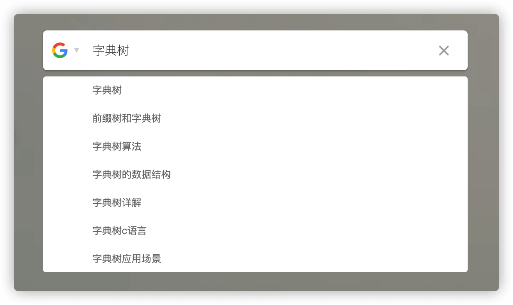

# 03.02.13 字典树（第 06 ~ 07 天）

## 1. 字典树简介

> **字典树（Trie）**：又称为前缀树、单词查找树，是一种树形结构。顾名思义，就是一个像字典一样的树。它是字典的一种存储方式。字典中的每个单词在字典树中表现为一条从根节点出发的路径，路径相连的边上的字母连起来就形成对应的字符串。

例如下图就是一棵字典树，其中包含有 `a`、`abc`、`acb`、`acc`、`ach`、`b`、`chb` 这 7 个单词。


从图中可以发现，这棵字典树用边来表示字母，从根节点到树上某一节点的路径就代表了一个单词。比如 1 → 2 → 6 → 10 表示的就是单词 `acc`。为了清楚地标记单词，我们可以在每个单词的结束节点位置增加一个 `end` 标记（图中红色节点），表示从根节点到这里有一个单词。

字典树的结构比较简单，其本质上就是一个用于字符串快速检索的多叉树，树上每个节点都包含多字符指针。将从根节点到某一节点路径上经过的字符连接起来，就是该节点对应的字符串。

**字典树设计的核心思想 **：利用空间换时间，利用字符串的公共前缀来降低查询时间的开销，最大限度的减少无谓的字符串比较，以达到提高效率的目的。

下面我们来归纳一下 **字典树的基本性质**：

- 根节点不包含字符，除根节点外，每个节点都只包含一个字符。
- 从根节点到某一节点，路径航经过的字符串连接起来，就是该节点对应的字符串。
- 每个节点的所有子节点包含的字符串都不相同。

## 2. 字典树的基本操作

字典树的基本操作有 **创建**、**插入**、**查找** 和 **删除**。其中删除操作是最不常用，我们这里主要介绍字典树的创建、插入和查找。

### 2.1 字典树的结构

#### 2.1.1 字典树的节点结构

首先我们先来定义一下字典树的节点结构。

上面说到字典树是一棵多叉树，这个 **「多叉」** 的意思是一个节点可以有多个子节点。而多叉的实现方式可以使用数组实现，也可以使用哈希表实现。接下来我们来介绍一下这两种节点结构。

- 如果字符串所涉及的字符集合只包含小写英文字母的话，我们可以使用一个长度为 `26` 的数组来表示当前节点的多个子节点，如下面代码所示。

```Python
class Node:                                         # 字符节点
    def __init__(self):                             # 初始化字符节点
        self.children = [None for _ in range(26)]    # 初始化子节点
        self.isEnd = False                          # isEnd 用于标记单词结束
```

代码中，`self.children` 使用数组实现，表示该节点的所有子节点。`isEnd` 则用于标记单词是否结束。

这样，如果我们在插入单词时，需要先将单词中的字符转换为数字，再创建对应的字符节点，并将其映射到长度为 `26` 数组中。

- 如果所涉及的字符集合不仅包含小写字母，还包含大写字母和其他字符，我们可以使用哈希表来表示当前节点的多个子节点，如下面代码所示。

```Python
class Node:                                     # 字符节点
    def __init__(self):                         # 初始化字符节点
        self.children = dict()                  # 初始化子节点
        self.isEnd = False                      # isEnd 用于标记单词结束
```

代码中，`self.children` 使用哈希表实现，表示该节点的所有子节点。`isEnd` 则用于标记单词是否结束。这样，如果我们在插入单词时，直接根据单词中的字符创建对应的字符节点，并将其插入到对应的哈希表中。

下面为了统一代码和编写方便，本文代码全部以哈希表的形式来表示当前节点的多个子节点。

#### 2.1.2 字典树的基本结构

定义完了字典树的字符结构，下面我们定义下字典树的基本结构。在字典树的初始化操作时，定义一个根节点。并且这个根节点不用保存字符。在后续进行插入操作、查找操作都是从字典树的根节点开始的。字典树的基本结构代码如下。

```Python
class Trie:                                     # 字典树
    
    # 初始化字典树
    def __init__(self):                         # 初始化字典树
        self.root = Node()                      # 初始化根节点（根节点不保存字符）
```

### 2.2 字典树的创建和插入操作

字典树的创建指的是将字符串数组中的所有字符串都插⼊字典树中。而插⼊操作指的是将⼀个字符串插⼊字典树中。

#### 2.2.1 字典树的插入操作

在讲解字典树的创建之前，我们先来看一下如何在字典树中插入一个单词。具体步骤如下：

- 依次遍历单词中的字符 `ch`，并从字典树的根节点的子节点位置开始进行插入操作（根节点不包含字符）。
- 如果当前节点的子节点中，不存在键为 `ch` 的节点，则建立一个节点，并将其保存到当前节点的子节点中，即 `cur.children[ch] = Node()`，然后令当前节点指向新建立的节点，然后继续处理下一个字符。
- 如果当前节点的子节点中，存在键为 `ch` 的节点，则直接令当前节点指向键为 `ch` 的节点，继续处理下一个字符。
- 在单词处理完成时，将当前节点标记为单词结束。

```Python
# 向字典树中插入一个单词
def insert(self, word: str) -> None:
    cur = self.root
    for ch in word:                         # 遍历单词中的字符
        if ch not in cur.children:          # 如果当前节点的子节点中，不存在键为 ch 的节点
            cur.children[ch] = Node()       # 建立一个节点，并将其保存到当前节点的子节点
        cur = cur.children[ch]              # 令当前节点指向新建立的节点，继续处理下一个字符
    cur.isEnd = True                        # 单词处理完成时，将当前节点标记为单词结束
```

#### 2.2.2 字典树的创建操作

字典树的创建比较简单，具体步骤如下：

- 首先初始化一个字典树，即 `trie = Trie()`。
- 然后依次遍历字符串中的所有单词，将其一一插入到字典树中。

```Python
trie = Trie()
for word in words:
    trie.insert(word)
```

### 2.3 字典树的查找操作

#### 2.3.1 字典树的查找单词操作

在字典树中查找某个单词是否存在，其实和字典树的插入操作差不多。具体操作如下：

- 依次遍历单词中的字符，并从字典树的根节点位置开始进行查找操作。
- 如果当前节点的子节点中，不存在键为 `ch` 的节点，则说明不存在该单词，直接返回 `False`。
- 如果当前节点的子节点中，存在键为 `ch` 的节点，则令当前节点指向新建立的节点，然后继续查找下一个字符。
- 在单词处理完成时，判断当前节点是否有单词结束标记，如果有，则说明字典树中存在该单词，返回 `True`。否则，则说明字典树中不存在该单词，返回 `False`。

```Python
# 查找字典树中是否存在一个单词
def search(self, word: str) -> bool:
    cur = self.root
    for ch in word:                         # 遍历单词中的字符
        if ch not in cur.children:          # 如果当前节点的子节点中，不存在键为 ch 的节点
            return False                    # 直接返回 False
        cur = cur.children[ch]              # 令当前节点指向新建立的节点，然后继续查找下一个字符

    return cur is not None and cur.isEnd    # 判断当前节点是否为空，并且是否有单词结束标记
```

#### 2.3.2 字典树的查找前缀操作

在字典树中查找某个前缀是否存在，和字典树的查找单词操作一样，不同点在于最后不需要判断是否有单词结束标记。

```Python
# 查找字典树中是否存在一个前缀
def startsWith(self, prefix: str) -> bool:
    cur = self.root
    for ch in prefix:                       # 遍历前缀中的字符
        if ch not in cur.children:          # 如果当前节点的子节点中，不存在键为 ch 的节点
            return False                    # 直接返回 False
        cur = cur.children[ch]              # 令当前节点指向新建立的节点，然后继续查找下一个字符
    return cur is not None                  # 判断当前节点是否为空，不为空则查找成功
```

## 3. 字典树的实现代码

```Python
class Node:                                     # 字符节点
    def __init__(self):                         # 初始化字符节点
        self.children = dict()                  # 初始化子节点
        self.isEnd = False                      # isEnd 用于标记单词结束
        
        
class Trie:                                     # 字典树
    
    # 初始化字典树
    def __init__(self):                         # 初始化字典树
        self.root = Node()                      # 初始化根节点（根节点不保存字符）

    # 向字典树中插入一个单词
    def insert(self, word: str) -> None:
        cur = self.root
        for ch in word:                         # 遍历单词中的字符
            if ch not in cur.children:          # 如果当前节点的子节点中，不存在键为 ch 的节点
                cur.children[ch] = Node()       # 建立一个节点，并将其保存到当前节点的子节点
            cur = cur.children[ch]              # 令当前节点指向新建立的节点，继续处理下一个字符
        cur.isEnd = True                        # 单词处理完成时，将当前节点标记为单词结束

    # 查找字典树中是否存在一个单词
    def search(self, word: str) -> bool:
        cur = self.root
        for ch in word:                         # 遍历单词中的字符
            if ch not in cur.children:          # 如果当前节点的子节点中，不存在键为 ch 的节点
                return False                    # 直接返回 False
            cur = cur.children[ch]              # 令当前节点指向新建立的节点，然后继续查找下一个字符

        return cur is not None and cur.isEnd    # 判断当前节点是否为空，并且是否有单词结束标记

    # 查找字典树中是否存在一个前缀
    def startsWith(self, prefix: str) -> bool:
        cur = self.root
        for ch in prefix:                       # 遍历前缀中的字符
            if ch not in cur.children:          # 如果当前节点的子节点中，不存在键为 ch 的节点
                return False                    # 直接返回 False
            cur = cur.children[ch]              # 令当前节点指向新建立的节点，然后继续查找下一个字符
        return cur is not None                  # 判断当前节点是否为空，不为空则查找成功
```

## 4. 字典树的算法分析

假设单词的长度为 `n`，前缀的长度为 `m`，字符集合的维度为 `d`，则：

- **插入一个单词**：时间复杂度为 $O(n)$；如果使用数组，则空间复杂度为 $O(d^n)$，如果使用哈希表实现，则空间复杂度为 $O(n)$。
- **查找一个单词**：时间复杂度为 $O(n)$；空间复杂度为 $O(1)$。
- **查找一个前缀**：时间复杂度为 $O(m)$；空间复杂度为 $O(1)$。

## 5. 字典树的应用

字典树一个典型的应用场景就是：在搜索引擎中输入部分内容之后，搜索引擎就会自动弹出一些关联的相关搜索内容。我们可以从中直接选择自己想要搜索的内容，而不用将所有内容都输入进去。这个功能从一定程度上节省了我们的搜索时间。

例如下图，当我们输入「字典树」后，底下会出现一些以「字典树」为前缀的相关搜索内容。



这个功能实现的基本原理就是字典树。当然，像 Google、必应、百度这样的搜索引擎，在这个功能能的背后肯定做了大量的改进和优化，但它的底层最基本的原理就是「字典树」这种数据结构。

除此之外，我们可以把字典树的应用分为以下几种：

- **字符串检索**：事先将已知的⼀些字符串（字典）的有关信息存储到字典树⾥， 查找⼀些字符串是否出现过、出现的频率。
- **前缀统计**：统计⼀个串所有前缀单词的个数，只需统计从根节点到叶子节点路径上单词出现的个数，也可以判断⼀个单词是否为另⼀个单词的前缀。
- **最长公共前缀问题**：利用字典树求解多个字符串的最长公共前缀问题。将⼤量字符串都存储到⼀棵字典树上时， 可以快速得到某些字符串的公共前缀。对所有字符串都建⽴字典树，两个串的最长公共前缀的长度就是它们所在节点最近公共祖先的长度，于是转变为最近公共祖先问题。
- **字符串排序**：利⽤字典树进⾏串排序。例如，给定多个互不相同的仅由⼀个单词构成的英⽂名，将它们按字典序从⼩到⼤输出。采⽤数组⽅式创建字典树，字典树中每个节点的所有⼦节点都是按照其字母⼤⼩排序的。然后对字典树进⾏先序遍历，输出的相应字符串就是按字典序排序的结果。

## 参考资料

- 【书籍】算法训练营 陈小玉 著
- 【书籍】ACM-ICPC 程序设计系列 算法设计与实现 陈宇 吴昊 主编
- 【博文】[Trie 树 - 数据结构与算法之美 - 极客时间](https://time.geekbang.org/column/article/72414)
- 【博文】[一文搞懂字典树](https://segmentfault.com/a/1190000040801084)
- 【博文】[字典树 (Trie) - OI Wiki](